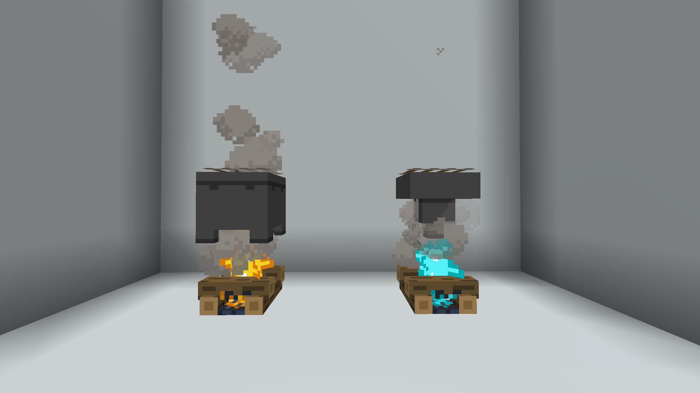

# Напитки

## Варочные аппараты

Напитки делятся на две подгруппы:  Те, которые готовятся на дистилляторе, и те, которые готовятся на варочном аппарате.

<figure><figcaption></figcaption></figure>

Слева - дистиллятор. Справа - варочный аппарат

## Дистиллятор

На дистилляторе готовятся приемущественно алкогольные напитки. \
Для готовки каждого напитка закиньте все ингридиенты в котел и ожидайте пока напиток выпадет.&#x20;


Обратите внимание, котел не должен быть наполнен водой!



Если не подобрать напиток за определенное время, то он испортится. Испорченные напитки дают немного другие эффекты - как отрицательные, так и положительные.


### Бальзам



<figure><figcaption></figcaption></figure>

Осколок призмарина, коричневый гриб, блок мха, бутылочка.



<figure><figcaption></figcaption></figure>

Скорость I\
Удача I\
Отравление I\
Тошнота V



### Бренди



<figure><figcaption></figcaption></figure>

Ламинария, светящаяся ягода, кроличья лапка, бутылочка



<figure><figcaption></figcaption></figure>

Ночное видение I\
Регенерация I\
Медленность II\
Отравление I\
Неудача V\
Тошнота III



### Ликёр



<figure><figcaption></figcaption></figure>

Светящаяся ягода, светокаменная пыль, сахар, кроличья лапка, бутылочка



<figure><figcaption></figcaption></figure>

Сила I\
Скорость III\
Отравление III\
Утомление II\
Неудача II\
Тошнота III



### Водка



<figure><figcaption></figcaption></figure>

Кроличья лапка, пшеница, костная мука, семена пшеницы, бутылочка



<figure><figcaption></figcaption></figure>

Иссушение I \
Медлительность II\
Удача I\
Тошнота V\
Утомление I



### Ром



<figure><figcaption></figcaption></figure>

Сахар, свёкла, бамбук, папоротник, кувшинка, бутылочка



<figure><figcaption></figcaption></figure>

Сила II\
Медлительность III\
Удача I\
Тошнота IV



#### Шампанское



<figure><figcaption></figcaption></figure>

Светящаяся ягода, яблоко, сладкая ягода, бутылочка.



<figure><figcaption></figcaption></figure>

Огнестойкость I\
Поглощение I\
Голод II



## Варочный аппарат

Варочный аппарат предназначен приемущественно для неалкогольных или слабо алкогольных напитков.&#x20;

### Эль-Кубелиус



<figure><figcaption></figcaption></figure>

Рудное золото, возвратный компас, незеритовый лом, черепаший щиток.



<figure><figcaption></figcaption></figure>

**Неизвестно**



### Какао



<figure><figcaption></figcaption></figure>

Светокаменная пыль, какао-бобы, бутылочка.



<figure><figcaption></figcaption></figure>

Снимает все эффекты с игрока, а также дает Регенерацию I



### Кофе&#x20;



<figure><figcaption></figcaption></figure>

Какао-бобы, сахар.



<figure><figcaption></figcaption></figure>

Скорость I\
Прилив здоровья II



### Лимонады



<figure><figcaption></figcaption></figure>

Золотое яблоко, бутылочка.



<figure><figcaption></figcaption></figure>

Слепота I\
Прыгучесть I



### Пиво



<figure><figcaption></figcaption></figure>

Хлеб, картофель, сушённая ламинария.



<figure><figcaption></figcaption></figure>

Насыщение I\
Утомление I\
Медлительность I\
Тошнота III


