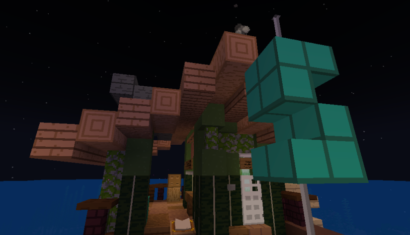

# Лицензия на магазины

Каждый магазин должен иметь лицензию. Здесь описано то, как ее получить.

### Оформление лицензии

Чтобы оформить лицензию, обратись в банк. Предварительно посчитай, сколько бочек (торговых мест) в твоем магазине.

### Категории

Всего есть три категории частных магазинов. Обратите внимание, что "бочкой" назван торговый слот. Это может быть и сундук и шалкер, и вообще что угодно.


Небольшой (от 1 до 25 бочек)



Средний (от 26 до 45 бочек)



Крупный (больше 45 бочек)


Стоимость лицензии будет рассчитана в банке банкиром.

### Внесение алмазов

Вносить алмазы за лицензию нужно в государственном банке на спавне. Оплачивать только наперёд, на 7 дней или длиннее. Например: 14, 21, 28 и т.д. дней.

<figure><figcaption></figcaption></figure>

