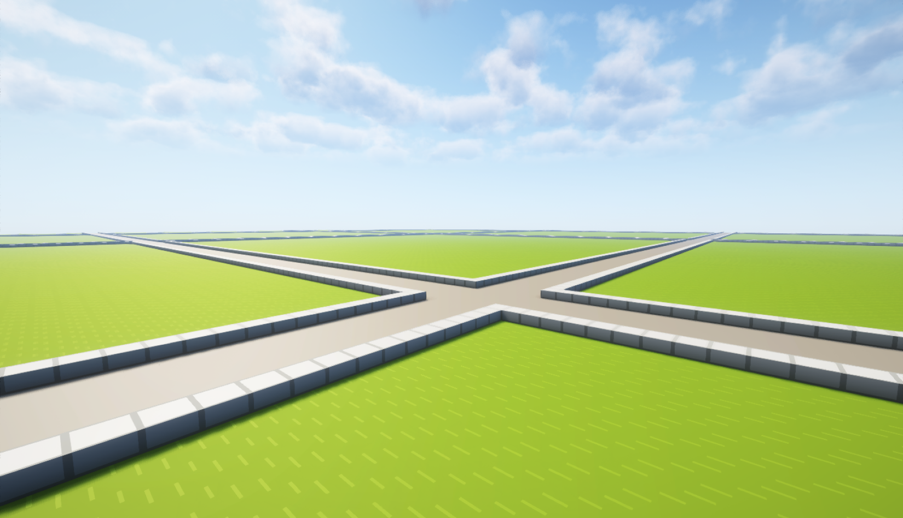

# Творческий сервер

Отличная возможность для совместных построек и место, где ты можешь проявить свои строительные навыки без ограничений.

### Участки

<figure><figcaption></figcaption></figure>

### Основные команды

Здесь мы перечислили основные команды плагина PlotSquared.


/plot auto — занять случайный участок



/plot auto <длина,ширина> — автоматически занять нескольких соединённых участков



/plot delete — удалить плот



/plot delete — удалить плот



/plot middle — телепортироваться на середину участка



/plot home <номер> — телепортироваться на свою точку



/plot unlink — разъединить участки



/plot claim — занять участок, на котором ты находишься



/plot claim — занять участок, на котором ты находишься



/plot info — посмотреть информация об участке



/plot list — посмотреть список участков



/plot name <название> — назвать участок



/plot visit <игрок> \[номер участка игрока] — посетить участок игрока



/plot trust <игрок> — дать возможность другому игроку строить на твоём участке



/plot deny <игрок> — запретить игроку находиться на твоём участке



/flyspeed <0.0-1.0> — изменение скорости полёта



BetterGoPaint — плагин, который упрощает рисование блоками через перо.\
Кликни сюда для подробностей



Citizens — плагин на NPC. Кликни сюда для подробностей


### Для игроков с подпиской Fusion

Только для игроков, которые имеют подписку Fusion


Дополнительные 16 участков



Доступ к плагину VoxelSniper для строительства.\
Кликни сюда для подробностей



Меню голов через команду /hdb, всего в базе данных целых 60+ тысяч голов\
Кликни сюда для подробностей



Флаги для плотов


### Решение популярных проблем

На творческом сервере у тебя могут возникнуть проблемы со вставкой схематики


Для вставки схематики, нужно включить commandUseWorldEdit в основных настройках мода Litematica


Как попасть на творческий сервер?


Нужно зайти на портал в Лобби сервера


